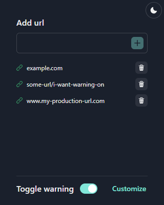

#  Page warning extension

An extention for chrome to add custom warning to a page matching an url

## Add url and customize colors

Add the urls or text that matches the webpages you want the alert to appear on.

You can also toggle the warning on or off.

## Banner warning (default)

The default warning type, will add a banner warning to the top of a page. Able to change color using the customization feature

## How to install

Currently the extention is not added to the store and as such we have to install it manually

1. Clone the repository
1. Go to directory where you cloned
1. run `bun install && bun run build`
1. Go to [chrome://extensions/](chrome://extensions/)
1. Turn on developer mode in top right corner
1. Click the "Load unpacked" button in the top left corner
1. Select the `dist` folder in the directory you cloned the repository
1. It should now be added to chrome and you can start using it 🙌
